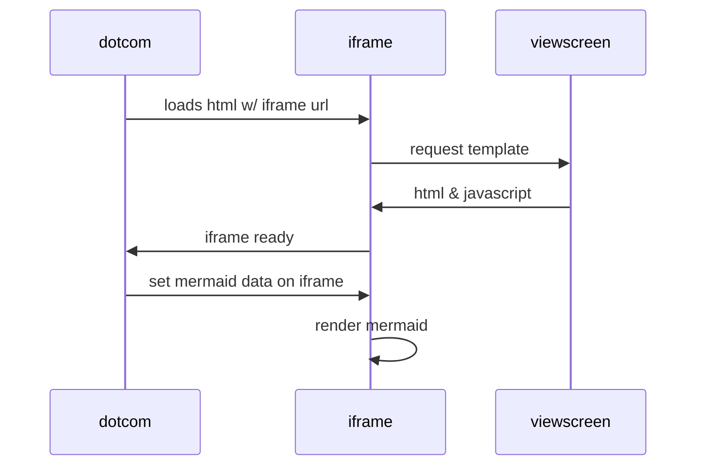

# Questão 1
Escreva instruções de Máquina A32 para as seguintes pseudo-instruções:

```assembly
nop
incr r0
decr r0
```

## Resposta
No arm não há addi, por exemplo.

```assembly
mov r0, #0
add r0, r0, #1
sub r0, r0, #1
```

# Questão 2
Escreva instruções de Máquina A32 para as seguintes pseudo-instruções:

```assembly
clr r0 // zera r0
not r0 // inverte r0 bit a bit
neg r0 // faz r0 = -r0
```

## Resposta 
```assembly
and r0, r0, #0 // mov r0, #0
mun r0, r0
rsb r0, r0, #0
```

# Questão 3
Escreva instruções de Máquina A32 para as seguintes pseudo-instruções:

```assembly
ror r0, #3 // roda r0 tres bits a direita
push r0 // coloca r0 na pilha
dob 40 // duplica o valor de r0
```

## Resposta
Tem de decrementar o stack pointer, por quê?

```assembly
mov r0, r0, ror #3 // ou lsr r0, r0, #3
srt r0, [sp, #-4] // ou stmdb sp!, {r0}
add r0, r0, r0 // ou lsl r0, r0, #1 ou mov r0, r0, lsl #1
```

# Questão 4
Essas instruções existem no conjunto A32 ou não e por que?

```assembly
mov sp, r0, r1, lsr #8
adds r3, pc, r0, rol #1
```

## Resposta
mov errado pois só pode 2 parametros (e tem 3)
rol não existe

```assembly
naosei
adds r3, pc, r0, ror #31
```

Se usasse registrador na segunda instrução:
```assembly
rsb r3, r2, #32
mov r1, r1, ror r3
```

# Questão 5
Essas instruções existem no conjunto A32 ou não e por que?

```assembly
muls r8, [r3, #4]!
blne r10
```

## Resposta
Não, pois muls não pode acessar vetorial, além disso,
muls necessita de 3 params.

No caso de blne, não funciona com registrador,
e, sim, com label ou offset de pc.

# Questão 6
Essas instruções existem no conjunto A32 ou não e por que?

```assembly
rsb r4, r9 #0x1ff
strb r5, [sp]!, #4
```

## Resposta
Na primeira instrução, não existe rsb com imediato.

Quanto a segunda instrução:
! significa pré-indexado e strb é store byte

Quando há pré-indexado, sp é atualizado:
```assembly
strb r5, [sp, #4]! // r5 é salvo em sp + 4, sp vira sp + 4
```

Quando não tem !, sp não é atualizado
```assembly
strb r5, [sp, #4] // r5 é salvo em sp + 4
```

Quando [sp], #4 -> pós indexado, r5 é guardado em sp, e depois sp é atualizado
```assembly
strb r5, [sp], #4 // r5 é salvo em sp, sp vira sp + 4
```

# Questão 7
Essas instruções existem no conjunto A32 ou não e por que?

```assembly
ldrle r0, [r8, r2, #-4]
ldr r3, [r1], r2, lsl #4
```

## Resposta

Na primeira instrução:

```assembly
ldrle r0, [r8, r2, #-4]
```

Não há a estrutura com 3 argumentos em [...]

Assim, poderia ser:

```assembly
ldrle r0, [r8, r2] // ou
ldrle r0, [r8, #-4]
```

Já na segunda instrução, pega-se o valor na posição r1, e soma-se com o valor de (r2 shiftado em 4, ou, multiplicado por 2^4=16)
e coloca-se esse resultado em r3.

# Questão 8
Quais os problemas neste vetor de interrupções?

```assembly
.text
.org 0
v_reset: b _reset
v_undef: b _undef
v_swi: bl _swi
v_abrt1: nop
v_abrt2: b _panic
b _panic
v_irq: b _irq
v_fiq: b _fiq
```

## Resposta
Ler Apostila - Vetor de Interrupções

bl: não pode ter o linked porque ele ficaria preso ali -> perde o endereço de retorno

Está colocado no segmento de .text: erro,
tem que começar com qualquer coisa diferente de texto que vai parar no endereço 0.

# Questão 9
Há algo errado neste código em assembler?

```assembly
.data
a: .word 0x0000f0f0

.text
.global f1
f1:
    ldr r0, =a
    ldr r1, [r0]
    ldr r0, =b
    ldr r2, [r0]
    add r1, r1, r2
    mov lr, pc

b: .word 0x0000caca
```

## Resposta
Mover pc para lr está errado.
Não tem como saber o valor "a" porque ele está em outro segmento.
Ou seja, assembler não sabe endereço de "a", apenas o linker.

A forma correta seria, por exemplo:

```assembly
.data
a: .word 0x0000f0f0

.text
.global f1
f1:
    ldr r0, =ea
    ldr r1, [r0]
    ldr r0, =b
    ldr r2, [r0]
    add r1, r1, r2
    mov pc, lr

b: .word 0x0000caca
ea: .word a
```

# Questão 10
Implemente a função f2 em assembler (A32):

```c
int f2(int a, int b) {
    int c = a + 4*b;
    return c;
}
```

## Resposta

```assembly
f1:
    add r0, r0, r1, lsl #2
    bx  lr
```

A função soma r0 a r1 shiftado de 2, ou seja, multiplicado de 2^2 e salva em r0,
que já é o valor a ser retornado.

Não precisa salvar r0, r1, r2 e r3, porque de acordo com sei lá qual regra arbitrária
eles são rascunho/descartáveis.
Eles também são os argumentos e r0 é retorno da função.
Ou seja, sempre que se quer salvar algum desses, tem de se usar outros regs.

# Questão 11
Implemente uma função f3 em assembly (A32), assumindo que exista uma função do
runtime chamada _mod32i() que calcula o resto da divisão:

```c
int f3(int a, int b) {
    if(a % b) return b; // usa _mod32i para calcular o resto
    else return 0;
}
```

## Resposta

```assembly
push {r4, lr}
mov r4, r1
bl  _mod32i
adds r0, r0, #0
movne r0, r4
moveq r0, #0
pop {r4, pc}
```

Tem de se salvar lr.

# Questão 12

Considere a função f2 abaixo e explique a ordem na qual o compilador vai colocar
as instruções strb, add e fadd (instrução do coprocessador 10).

```c
int f2(int a, float b, char c) {
    char d = a + c;
    return d + b;
}
```

## Resposta

1. add: soma do "a" e "c"
2. strb: por causa do "d"
3. fadd: soma de pf de "d+b"

strb vai salvar na pilha "d"
como "d" é char, tem 1 byte

Além disso, como "d" é char, precisa-se matar os bits mais significativos.

# Questão 13
A sequência de estados a seguir é válida? Aponte uma possível sequência de eventos
para causá-la.



## Resposta

# Questão 14

## Resposta

# Observações

CPUlator
O que é bx?
vetor de interrupt

adds?
